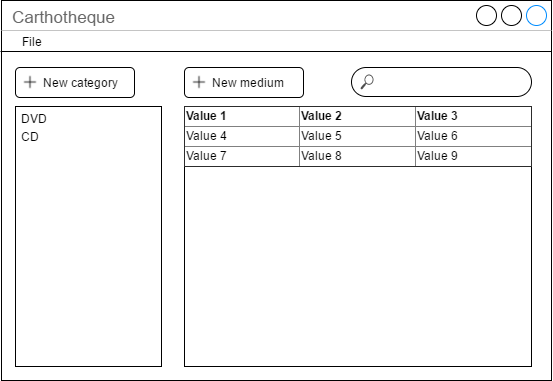

---
---

# Welcome to our project!

Checkout [Javadocs](documentation.html) for basic architecture of our app

# XML structure

This is a sample xml file of how we will store the movie database:

```xml
<carthotheque>

    <categories>
        <category id="dvd" name="DVD">
            <column id="1" name="Film 1" />
            <column id="2" name="Film 2" />
            <column id="4" name="Poznámky" />
        </category>
        <category id="cd" name="CD">
            <column id="1" name="Film 1" />
            <column id="2" name="Film 2" />
        </category>
    </categories>

    <media>
        <medium id="1" category_id="cd">
            <column-value column_id="1">Mr Bean</column-value>
            <column-value column_id="2">Mr Bean 2</column-value>
        </medium>
    </media>

</carthotheque>
```


# Proposed prototypes




