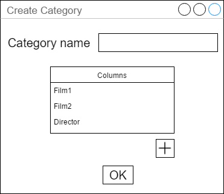
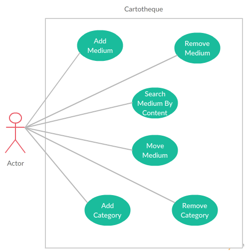

# Welcome to our project!

Checkout [Javadocs](documentation.html) for basic architecture of our app

On instructions how to build, checkout [wiki](https://github.com/misostc/PB138-video-cartotheque/wiki/How-to-build)

To get built binaries, go to [releases](https://github.com/misostc/PB138-video-cartotheque/releases)

# Final Screenshots

# Proposed prototypes

# UML diagrams

Basic class diagram:

